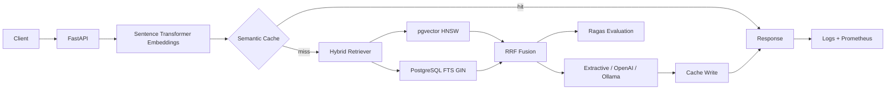

# Enterprise RAG Pipeline

A complete, deployment-ready Retrieval-Augmented Generation service with:

- PostgreSQL + pgvector dense vector retrieval
- PostgreSQL full-text keyword retrieval
- Reciprocal-rank-fusion hybrid search
- Tenant-aware semantic caching
- FastAPI REST endpoints and OpenAPI documentation
- Local extractive generation with no API key required
- Optional OpenAI and Ollama generation
- Automated Ragas evaluation, including no-key retrieval metrics
- Synthetic enterprise documents and a golden evaluation dataset
- Alembic migrations, Docker Compose, Kubernetes manifests, tests, CI, metrics, and structured logs

## Architecture



The same PostgreSQL database stores documents, chunks, vectors, generated full-text indexes, semantic-cache entries, and evaluation runs. Dense and keyword rankings are fused with reciprocal-rank fusion so their incompatible score scales never need manual normalization.

## Fastest start

Requirements: Docker Desktop or Docker Engine with Docker Compose v2, at least 4 GB free memory, and internet access for the first image build so the embedding model can be downloaded.

```bash
# 1. Unzip and enter the project
cd enterprise-rag-pipeline

# 2. Start PostgreSQL and the API
# The safe demo configuration needs no .env file and automatically seeds the synthetic corpus.
docker compose up --build -d

# 3. Wait for readiness
docker compose ps
curl http://localhost:8000/health/ready

# 4. Ask a question
curl -s http://localhost:8000/v1/query \
  -H 'Content-Type: application/json' \
  -d '{
    "tenant_id": "demo",
    "question": "How quickly must a Severity 1 security incident be acknowledged?"
  }'
```

Interactive API docs: `http://localhost:8000/docs`

## Push directly to GitHub

```bash
git init
git add .
git commit -m "Initial enterprise RAG pipeline"
git branch -M main
git remote add origin https://github.com/YOUR_ORG/enterprise-rag-pipeline.git
git push -u origin main
```

Both GitHub Actions workflows run automatically on `main`: standard quality checks and the synthetic RAG evaluation gate.

The first query uses retrieval and generation. Repeating a semantically similar question should return `"cached": true` when similarity exceeds the configured threshold.

## Useful commands

```bash
make up          # Build and start
make logs        # Follow API logs
make seed        # Re-seed the bundled corpus
make smoke       # Run an end-to-end sample query
make evaluate    # Run the golden evaluation set
make evaluate-ci # Run evaluation and enforce retrieval quality thresholds
make test        # Unit tests
make down        # Stop containers
make clean       # Stop and remove database volume
```

## Configuration

Copy `.env.example` to `.env` only when overriding defaults:

```bash
cp .env.example .env
```

Important settings:

| Setting | Default | Purpose |
|---|---:|---|
| `LLM_PROVIDER` | `extractive` | `extractive`, `openai`, or `ollama` |
| `EMBEDDING_MODEL` | `sentence-transformers/all-MiniLM-L6-v2` | Local embedding model |
| `CACHE_SIMILARITY_THRESHOLD` | `0.93` | Minimum cosine similarity for a semantic-cache hit |
| `CACHE_TTL_SECONDS` | `3600` | Cache lifetime |
| `RETRIEVAL_TOP_K` | `5` | Final chunks passed to generation |
| `RETRIEVAL_CANDIDATE_K` | `40` | Dense and keyword candidate pool |
| `RRF_K` | `60` | Reciprocal-rank-fusion smoothing constant |
| `API_KEY` | empty | When set, clients must send `X-API-Key` |

### OpenAI mode

```bash
cat >> .env <<'ENV'
LLM_PROVIDER=openai
OPENAI_API_KEY=your-key
OPENAI_MODEL=gpt-4o-mini
ENV

docker compose up --build -d
```

### Local Ollama mode

The optional compose file starts Ollama and downloads `llama3.2:3b`:

```bash
docker compose -f docker-compose.yml -f docker-compose.ollama.yml up --build -d
```

## API examples

### JSON ingestion

```bash
curl -s http://localhost:8000/v1/documents/ingest \
  -H 'Content-Type: application/json' \
  -d '{
    "tenant_id":"demo",
    "documents":[{
      "source_id":"MY-001",
      "title":"My Policy",
      "content":"Critical issues must be acknowledged within 20 minutes.",
      "metadata":{"category":"policy","department":"operations"}
    }]
  }'
```

### File upload

Supported types are PDF, Markdown, text, CSV, and JSON.

```bash
curl -s http://localhost:8000/v1/documents/upload \
  -F tenant_id=demo \
  -F category=policy \
  -F department=security \
  -F files=@policy.pdf
```

### Filtered hybrid query

```bash
curl -s http://localhost:8000/v1/query \
  -H 'Content-Type: application/json' \
  -d '{
    "tenant_id":"demo",
    "question":"What approvals are needed for high-risk AI?",
    "filters":{"department":"risk"},
    "top_k":5,
    "use_cache":true
  }'
```

### Cache administration

```bash
curl 'http://localhost:8000/v1/cache/stats?tenant_id=demo'
curl -X DELETE 'http://localhost:8000/v1/cache?tenant_id=demo'
```

## Automated evaluation

The bundled `synthetic_data/evaluation/golden_dataset.jsonl` includes questions, reference answers, and expected source IDs.

```bash
# Runs end-to-end queries and writes JSON + CSV under artifacts/evaluations/
docker compose exec api python -m scripts.evaluate
```

Without an OpenAI key, the evaluation still uses Ragas for ID-based context precision and context recall, and also reports source hit rate, mean reciprocal rank, token F1, answer embedding similarity, and latency.

With `OPENAI_API_KEY`, it additionally calculates Ragas faithfulness, answer relevancy, context precision, context recall, and factual correctness. LLM-as-judge evaluation has cost and should be executed against an approved evaluation model.

The repository also includes a `RAG Evaluation` GitHub Actions workflow that starts the stack, runs the no-key Ragas evaluation gate, checks `synthetic_data/evaluation/thresholds.json`, and uploads JSON/CSV reports.

The evaluation API is also available:

```bash
curl -s -X POST http://localhost:8000/v1/evaluations/run \
  -H 'Content-Type: application/json' \
  -d '{
    "tenant_id":"demo",
    "dataset_path":"synthetic_data/evaluation/golden_dataset.jsonl",
    "include_llm_metrics":false
  }'
```

## Local development without Docker for the API

Run PostgreSQL from Compose, then point the application at localhost:

```bash
docker compose up -d postgres
python -m venv .venv
source .venv/bin/activate  # Windows PowerShell: .venv\Scripts\Activate.ps1
python -m pip install -e ".[dev]"
cp .env.example .env
# Change both database hostnames in .env from postgres to localhost.
alembic upgrade head
python -m scripts.seed --reset
uvicorn app.main:app --reload
```

## Production deployment

Build and publish the image:

```bash
docker build -t ghcr.io/your-org/enterprise-rag-pipeline:1.0.0 .
docker push ghcr.io/your-org/enterprise-rag-pipeline:1.0.0
```

Kubernetes manifests are in `deploy/k8s`. Replace the image, create the secret from a secret manager, run the migration job, and then apply the workload:

```bash
kubectl apply -f deploy/k8s/secret.yaml
kubectl apply -f deploy/k8s/migration-job.yaml
kubectl apply -k deploy/k8s
```

Production recommendations:

- Use managed PostgreSQL with pgvector, encryption, backups, PITR, and connection pooling.
- Terminate HTTPS at a trusted ingress and set `API_KEY` or replace it with enterprise OIDC/JWT authorization.
- Add PostgreSQL row-level security for defense-in-depth tenant isolation.
- Store secrets in your cloud secret manager rather than YAML or `.env` files.
- Pin and scan the final container image; the supplied CI builds the image but does not publish it.
- Run migrations as a single release job, not concurrently in every replica.
- Size memory for the embedding model and number of worker replicas. Keep one Uvicorn process per container and scale containers horizontally.
- Review uploaded-document handling, malware scanning, DLP, data residency, model vendor terms, and retention rules before using sensitive data.
- Establish quality thresholds in CI using the generated evaluation JSON.

## Repository layout

```text
app/                    FastAPI, models, retrieval, cache, generation, evaluation
migrations/             Alembic database migrations
scripts/                Seed, smoke-test, and evaluation commands
synthetic_data/          13 enterprise documents and golden dataset
tests/                   Unit and optional integration tests
deploy/k8s/              Deployment, service, HPA, PDB, policy, migration job
.github/workflows/       Lint, tests, and Docker build
artifacts/evaluations/   Generated JSON and CSV evaluation reports
```

## Notes

- The default extractive provider is deterministic and makes the repository runnable without a paid model. For production-quality answer synthesis, select OpenAI or Ollama.
- Changing the embedding model dimension requires updating `EMBEDDING_DIMENSION` and creating a corresponding migration or rebuilding the database.
- Semantic-cache isolation includes tenant, filter namespace, and prompt version. Model or prompt upgrades should increment `PROMPT_VERSION`.
- This repository is synthetic and contains no customer or personal data.

See `docs/architecture.md`, `SECURITY.md`, and `CONTRIBUTING.md` for additional details.
